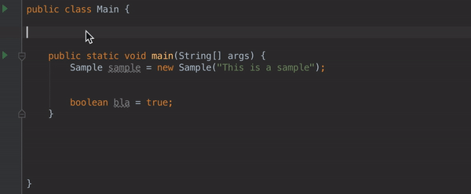
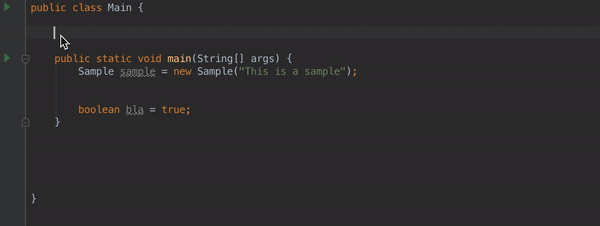
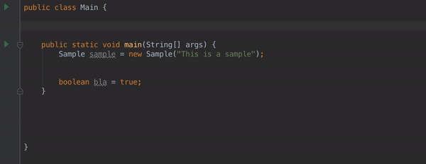
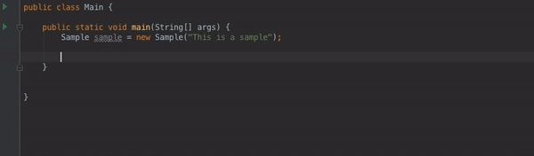
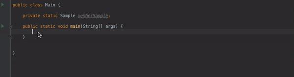
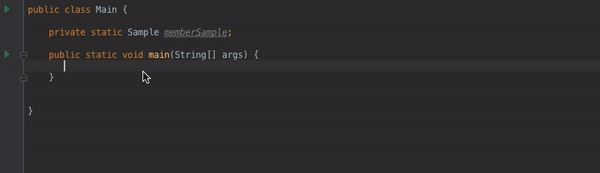
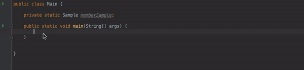
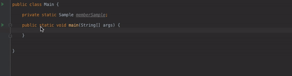
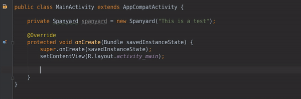
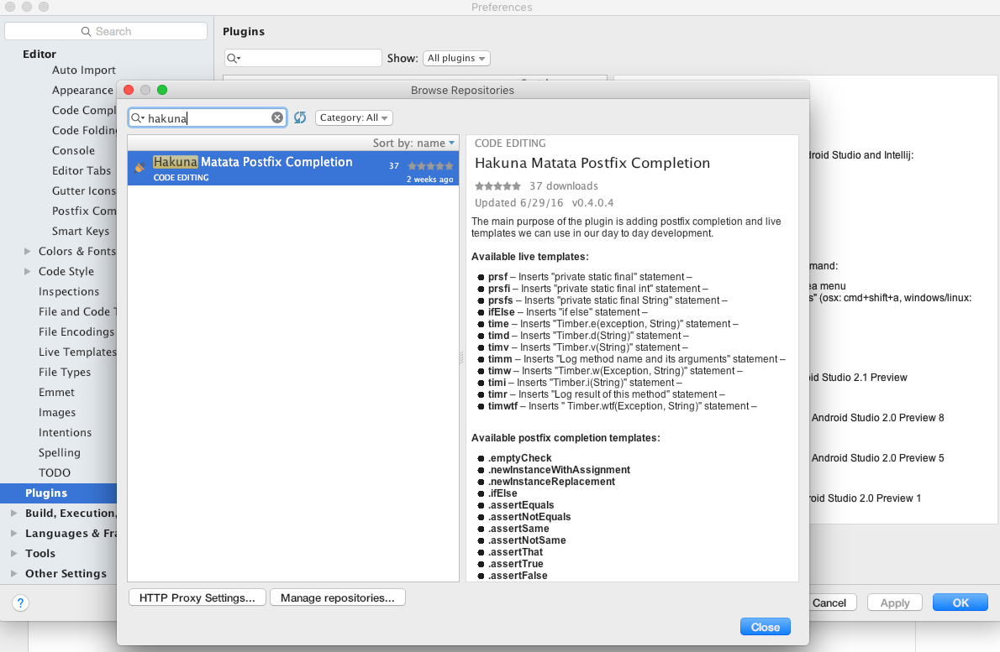

# Hakuna Matata Development IntelliJ / AS Plugin

#### Table of Contents

- <a href="#motivation">__Motivation__</a>
  - <a href="#existing_templates">__Existing templates__</a>
- <a href="#description">__Description__</a>
    - <a href="#live_templates">__Live templates__</a>
    - <a href="#postfix_autocompletions">__Postfix autocompletions__</a>
- <a href="#how_to">__How to use__</a>
- <a href="#changelog">__Changelog__</a>
- <a href="#feedback_contribution">__Feedback and contribution__</a>
- <a href="#main_contributors">__Main contributors__</a>
- <a href="#references">__References__</a>
- <a href="#license">__License__</a>

 

<a name="motivation">
### Motivation

There are already a bunch of postfix completions for both IntelliJ / Android Studio, but this list could be
happily improved by adding more completions and templates to related libraries we use in our day to day. Moreover, the
easiest way to share live templates is by a plugin, not to copy manually all files in IntelliJ / Android Studio
configuration folder.

Whenever the repo reaches the final version, would be good to merge some of this completions to IntelliJ Community, but
first I wanted to give a try to all of you and improve/change/add some other completions and useful templates.

<a name="existing_templates">
#### Existing templates

These are some of the most important ones (not source information related yet):

| Android           | AndroidLog | AndroidParcelable      | iterations | other | output | plain |
| ----------------- | ---------- | ---------------------- | ---------- | ----- | ------ | ----- |
| const             | logd       | Parcelable             | fori       | geti  | serr   | psf   |
| foreach           | loge       | ParcelableEnum         | itar       | ifn   | souf   | psfi  |
| gone              | logi       | ParcelableEnumTest     | itco       | inn   | sout   | psfs  |
| IntentView        | logm       | ParcelBoolean          | iten       | inst  | soutm  | St    |
| key               | logr       | UnparcelBoolean        | iter       | lazy  | soutp  | thr   |
| newInstance       | logt       | UnparcelIntArray       | itit       | last  | soutv  |       |
| noInstance        | logw       | UnparcelStringArray    | itli       | mn    |
| rgS               | wtf        |                        | ittok      | mx    |
| rouiT             |            |                        | itve       | psvm  |
| sbc               |            |                        | ritar      | toar  |
| Sfmt              |            |
| starter           |            |
| Toast             |            |
| ViewConstructors  |            |
| visible           |
| wrapIt            |

 

<a name="description">
### Description

<a name="live_templates">
#### Live templates

__Plain extra__

- `prsf`: private static final

    

- `prsfi`: private static final int

    

- `prsfs`: private static final String

    

__Other extra__

- `ifElse`: Inserts ''if else'' statement

    

__Timber__

(Basically offers the same functionality as the android log live templates)

- `time`: Timber.e(exception, String)

- `timd`: Timber.d(String)

- `timv`: Timber.v(String)

- `timm`: Log method name and its arguments

- `timw`: Timber.w(Exception, String)

- `timi`: Timber.i(String)

- `timr`: Log result of this method

- `timwtf`: Timber.wtf(Exception, String)

__Easter Egg__

- `trolling` (not working yet)

<a name="postfix_autocompletions">
### Postfix autocompletions

__Java__

- `newInstanceWithAssignment`:

  

- `newInstanceReplacement`

  
  

- `ifElse`

  

- `ifElseIf` (not working yet - experimental)

__Asserts__

- `assertEquals`:

- `assertNotEquals`:

- `assertSame`:

- `assertNotSame`:

- `assertThat`:

- `assertTrue`:

- `assertFalse`:

__Mockito__

- `whenThen`

- `whenThenCallRealMethod`

- `whenThenAnswer`

- `whenThenReturn`

- `whenThenThrow`

- `verify`

- `verifyNoMoreInteractions`

- `verifyZeroInteractions`

- `doNothingWhen`

- `doReturnWhen`

- `doThrowWhen`

- `mock`

__Android__

- `emptyCheck`

  

 

<a name="how_to">
### How to use

The plugin will be ready to be downloaded from the IntelliJ plugin repository whenever the release 1.0 comes out. Meanwhile you need to download [__this jar__](https://github.com/cesards/HakunaMatataIntelliJPlugin/raw/master/HakunaMatata.jar) compiled in the repo with last changes, open IntelliJ preferences and look for the `Plugins` section and install it as shown in the following picture:

 

<a name="changelog">
### Changelog

- __0.4 (2016-06-27)__
   - First `Android`, `Mockito`, `Java` and `Assert` type completions added.
   - `Plain extra` and `Other extra` live templates added.

 

<a name="feedback_contribution">
### Feedback and contribution

This has been open-sourced for a main purpose, make developing's life easier during your day to day. I encourage you to suggest improvements, like better namings for the completions or templates, parametrizations and so on. Feel free to ask for anything and contribute to whatever you would like to improve.

 

<a name="main_contributors">
### Main contributors

<a href="https://github.com/cesards">
   César Díez</b>
</a>
<a >
    - </b>
</a>

 

<a name="references">
### References

- [__keyboardsurfer idea-live-templates__](https://github.com/keyboardsurfer/idea-live-templates)
- [__Sharing Live Templates Creating and Editing Template Variables__](https://www.jetbrains.com/help/idea/2016.1/creating-and-editing-template-variables.html)

 

<a name="license">
### License

    Copyright 2016 César Díez (@cesards)

    Licensed under the Apache License, Version 2.0 (the "License");
    you may not use this file except in compliance with the License.
    You may obtain a copy of the License at

       http://www.apache.org/licenses/LICENSE-2.0

    Unless required by applicable law or agreed to in writing, software
    distributed under the License is distributed on an "AS IS" BASIS,
    WITHOUT WARRANTIES OR CONDITIONS OF ANY KIND, either express or implied.
    See the License for the specific language governing permissions and
    limitations under the License.
